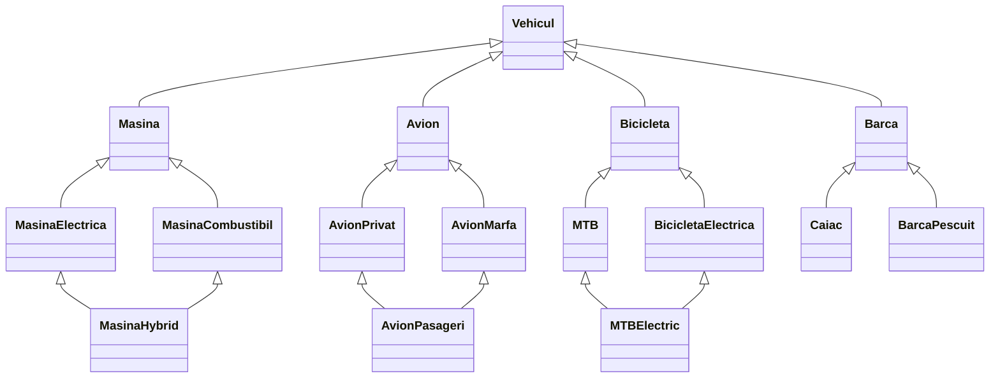

# Ontologie
Proiect educațional care demonstrează principiile Programării Orientate pe Obiecte în Python: clase, moștenire simplă, moștenire multiplă, polimorfism (suprascrierea metodei afisare()) și încapsulare logică a datelor, pe exemplul unei ierarhii de vehicule (mașini, avioane, biciclete și bărci).

## Cuprins

- [Concepte POO ilustrate](#concepte-poo-ilustrate)
- [Structura ierarhiei](#structura-ierarhiei)
- [Cerințe și rulare](#cerințe-și-rulare)
- [Descrierea claselor](#descrierea-claselor)
- [Exemple de utilizare](#exemple-de-utilizare)
- [Moștenirea multiplă și MRO](#moștenirea-multiplă-și-mro)
- [Probleme cunoscute și îmbunătățiri](#probleme-cunoscute-și-îmbunătățiri)

## Concepte POO ilustrate

| Concept | Unde apare |
|---|---|
| Clasă de bază | `Vehicul` |
| Moștenire simplă | `Masina(Vehicul)`, `Avion(Vehicul)`, `Bicicleta(Vehicul)`, `Barca(Vehicul)` etc. |
| Moștenire multiplă (problema diamantului) | `MasinaHybrid`, `AvionPasageri`, `MTBElectric` |
| Polimorfism / suprascriere | `afisare()` redefinită în fiecare clasă |
| Apel către clasa părinte | `super().__init__(...)`, `super().afisare()` |
| Apel explicit către un constructor de bază | `Masina.__init__(self, ...)`, `Avion.__init__(self, ...)`, `Bicicleta.__init__(self, ...)` |

## Structura ierarhiei



## Cerințe și rulare

- **Python 3.8+** (se folosesc doar funcții din biblioteca standard, nu există dependențe externe).

```bash
git clone https://github.com/<utilizator>/<repository>.git
cd <repository>
python main.py
```

> Înlocuiește `main.py` cu numele real al fișierului. La rulare, scriptul creează câte o instanță din fiecare clasă și apelează metodele ei, afișând rezultatele în consolă, secțiune cu secțiune (`----VEHICUL----`, `----MASINA----` etc.).

## Descrierea claselor

### `Vehicul` (clasa de bază)

**Atribute:** `model`, `greutate` (kg), `viteza` (km/h), `culoare`, `an_fabricatie`, `dimensiuni` (tuplu `(L, l, h)` în metri).

| Metodă | Descriere |
|---|---|
| `afisare()` | Afișează toate datele vehiculului |
| `porneste()` / `opreste()` | Pornește / oprește vehiculul |
| `accelereaza(plus)` | Crește viteza |
| `franeaza(minus)` | Scade viteza (minim 0) |
| `vopseste(culoare_noua)` | Schimbă culoarea |
| `setGreutate(greutate_noua)` | Setează greutatea |
| `varsta(an_curent=2025)` | Vechimea vehiculului în ani |
| `volumTotal()` | Volumul `L × l × h` |
| `esteClasic(an_limita=1980)` | `True` dacă vehiculul e anterior anului limită |
| `timpDeplasare(distanta)` | Timpul necesar pentru o distanță, la viteza curentă |

---

### 🚗 Mașini

**`Masina(Vehicul)`** – adaugă: `motorizare`, `nr_usi`, `putere` (CP), `transmisie`, `cutie_viteze`, `caroserie`, `volum_portbagaj` (L).
Metode: `schimbaViteza()`, `tuning()`, `clima()`, `modifCaroserie()`, `schimbaCutia()`, `schimbaTransmisia()`, `performanta()` (clasifică după raportul putere/greutate: sportivă / medie / slabă).

**`MasinaElectrica(Masina)`** – adaugă: `capacitate_baterie` (kWh), `nivel_baterie` (%), `autonomie` (km).
Metode: `baterieActuala()`, `incarcare(kwh)`, `autonomieParcurs(viteza)` (autonomia scade cu 30% peste 120 km/h), `consumBaterie()`, `poateParcurgeBaterie(distanta)`, `consumRutaBaterie(distanta)`.

**`MasinaCombustibil(Masina)`** – adaugă: `tip_combustibil`, `capacitate_cilindrica`, `capacitate_rezervor`, `nivel_combustibil` (L), `consum_mediu` (L/100km).
Metode: `autonomie()`, `procentCombustibil()`, `alimentare(litri)`, `poateParcurgeLitrii(distanta)`, `consumRutaLitrii(distanta)`.

**`MasinaHybrid(MasinaElectrica, MasinaCombustibil)`** – combină cele două tipuri de propulsie.
Metodă proprie: `conduce(distanta)` – încearcă mai întâi parcurgerea în regim electric; dacă bateria nu ajunge, trece pe combustibil.

---

### ✈️ Avioane

**`Avion(Vehicul)`** – adaugă: `tip`, `autonomie`, `capacitate_combustibil`, `nivel_combustibil`, `consum` (L/h), `altitudine` (maximă), `nr_motoare`, `putere` (kN).
Metode: `schimbaAltitudine()`, `autonomieRamasa()`, `consumRuta()`, `poate_parcurge()`, `alimentare()`.

**`AvionPrivat(Avion)`** – adaugă `nr_locuri`, `nr_pasageri`, `clasa`. Metode: `imbarcarePasageri()`, `debarcarePasageri()`.

**`AvionMarfa(Avion)`** – adaugă `capacitate` (kg), `marfa` (kg). Metode: `incarcaMarfa()`, `descarcaMarfa()`.

**`AvionPasageri(AvionPrivat, AvionMarfa)`** – avion care transportă pasageri și bagaje/marfă; adaugă `nr_echipa`.

---

### 🚲 Biciclete

**`Bicicleta(Vehicul)`** – adaugă: `lungime_cadru`, `latime_ghidon`, `transmisie`, `diametru_roti` (inch), `latime_cauciucuri` (mm), `frane`.
Metode: `timpParcurgere()`, `performanta()` (scor 0–6), `adultCopil()`, `tipDrum()`.

**`MTB(Bicicleta)`** – adaugă `suspensie` (`hardtail` / `full` / `fata`) și `nivel` (`incepator` / `intermediar` / `avansat`).
Metode: `dificultateTraseu()`, `tipMTB()`, `eficientaUrcare()`, `eficientaCoborare()`.

**`BicicletaElectrica(Bicicleta)`** – adaugă `autonomie`, `capacitate_baterie`, `nivel_baterie`, `timp_incarcare`.
Metode: `baterieActuala()`, `consum()`, `autonomieRamasa()`, `consumRuta()`.

**`MTBElectric(MTB, BicicletaElectrica)`** – bicicletă de munte cu asistență electrică.

---

### ⛵ Bărci

**`Barca(Vehicul)`** – adaugă `tip`, `tip_propulsie`, `material`. Metodă: `navigheaza(distanta)`.

**`Caiac(Barca)`** – adaugă `nr_locuri`. Metode: `adaugaLoc()`, `adunaVasle()`.

**`BarcaPescuit(Barca)`** – adaugă `capacitate_totala`, `capacitate_actuala` (kg). Metode: `incarcareBarca()`, `descarcareBarca()`.

## Exemple de utilizare

```python
# Mașină electrică
ev1 = MasinaElectrica("Tesla Model 3", 1625, 225, "Alb", 2021, (4.7, 1.8, 1.4),
                      "Electrica", 4, 283, "Spate", "Automata", "Sedan", 425,
                      4000, 80, 500)

ev1.afisare()
print(ev1.baterieActuala())        # 3200.0 kWh
print(ev1.poateParcurgeBaterie(200))
```

```python
# Mașină hibridă: electric întâi, apoi combustibil
mh = MasinaHybrid(
    "Toyota Prius", 1400, 90, "alb", 2022, (1.5, 2.0, 1.3),
    "hibrid", 5, 120, "fata", "automata", "hatchback", 400,
    8.8, 50, 55,
    "benzina", 1800, 43, 20, 4.5
)
mh.conduce(70)
```

```python
# Avion de marfă
am1 = AvionMarfa("Boeing 747 Cargo", 183500, 900, "alb", 2015, (70.6, 64.4, 19.4),
                 "cargo", 8000, 183380, 90000, 10800, 13100, 4, 280, 120000, 100000)
am1.incarcaMarfa(50000)
```

## Moștenirea multiplă și MRO

Trei clase folosesc moștenire multiplă (în formă de „diamant"): `MasinaHybrid`, `AvionPasageri` și `MTBElectric`. Python rezolvă ordinea de căutare a metodelor prin **MRO** (*Method Resolution Order*), bazat pe algoritmul C3:

```python
print([c.__name__ for c in MasinaHybrid.__mro__])
# ['MasinaHybrid', 'MasinaElectrica', 'MasinaCombustibil', 'Masina', 'Vehicul', 'object']
```

Pentru a evita apelarea de două ori a constructorului clasei comune (`Masina`, `Avion`, `Bicicleta`), aceste clase **nu folosesc `super().__init__()`**, ci apelează direct constructorul bazei comune și își inițializează singure atributele specifice.

## Probleme cunoscute și îmbunătățiri

Observații rezultate din analiza codului, utile ca TODO-uri:

- **`MasinaHybrid`: conflict de nume.** `self.autonomie = autonomie` (atribut) *umbrește* metoda `autonomie()` moștenită de la `MasinaCombustibil`; apelul `mh.autonomie()` ar da eroare. Soluție: redenumește atributul (ex. `autonomie_electrica`) sau metoda.
- **`MasinaCombustibil.poateParcurgeLitrii`:** formula `distanta * consum_mediu` nu împarte la 100 (consumul e în L/100 km). Corect: `distanta * consum_mediu / 100`.
- **`MasinaCombustibil` – afișarea rezultatului:** linia `print("Poate parcurge 200 km?:"), mc1.poateParcurgeLitrii(200)` creează un tuplu; metoda face deja `print`, deci rezultatul apare în ordine greșită. Metoda ar trebui să returneze `True`/`False`.
- **`MasinaElectrica.incarcare`:** calculează noua valoare, dar nu actualizează `nivel_baterie`; în plus, returnează `None` când bateria e plină.
- **`AvionMarfa.incarcaMarfa`:** condiția `<` ar trebui să fie `<=` pentru a permite umplerea exactă până la capacitate.
- **`AvionPasageri`:** apelurile de la finalul secțiunii folosesc `am1` în loc de `aps`, iar `afisare()` nu include `nr_echipa`.
- **Variabile suprascrise:** `b1` este folosită atât pentru `Bicicleta`, cât și pentru `Barca`.
- **Unități inconsistente:** `latime_cauciucuri` este în **mm** în `Bicicleta`, dar în **inch** în `MTB` (`> 2.3`, `>= 2.2`), ceea ce dă rezultate greșite la `tipDrum()` / `tipMTB()`.
- **Metode care afișează în loc să returneze:** ex. `Vehicul.timpDeplasare()` returnează uneori `None`; e preferabil să returneze valori și să afișeze doar în exterior.
- **Date de test:** unele dimensiuni (ex. Audi A5 `(1.4, 2.3, 1.2)`) au lungimea mai mică decât lățimea.
- **Structură:** pentru un proiect mai mare, împarte codul în module (`vehicul.py`, `masini.py`, `avioane.py`, `biciclete.py`, `barci.py`), mută codul de test sub `if __name__ == "__main__":`, folosește `abc.ABC` pentru `Vehicul`, `@property` în loc de metode tip getter/setter și adaugă teste cu `pytest`.
